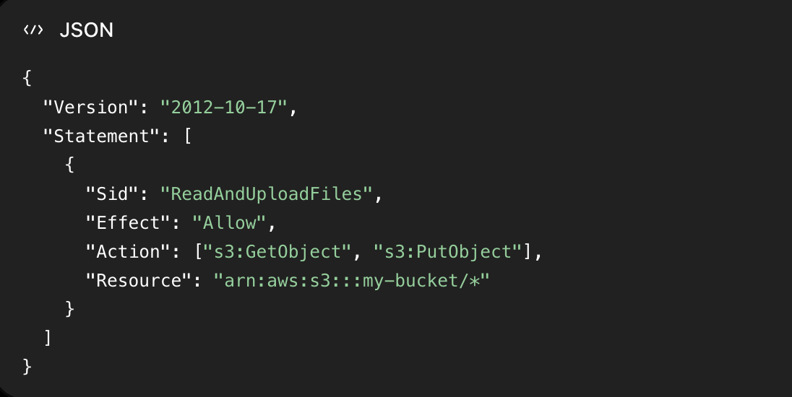

AWS started as technology that Amazon built for itself to run its online shop.

Amazon then realised:

“Our infrastructure is powerful. Why not let other companies use it too?”

Timeline:

2002 — Used inside Amazon
Amazon created infrastructure to support its own website and online orders.

2003 — The AWS idea
Amazon decided it could offer this infrastructure to other companies as a paid service.

2004 — First public service
Amazon launched SQS, which helps different parts of an application send and manage messages.

2006 — Major AWS launch
Amazon introduced three important services:
S3 — store files and data
EC2 — rent virtual computers/servers
SQS — send and manage messages between systems

2007 — AWS expanded globally
AWS launched in Europe, allowing more businesses around the world to use its cloud infrastructure.

AWS is not only for one type of company. It can power many different businesses and applications.

## What can AWS do?

- Build and run applications
- Increase resources as an application grows
- Store files and data
- Back up important information
- Analyse large amounts of data
- Host websites and mobile apps
- Run online games for players around the world

Industries using AWS
- IT: storage, backups and data analysis
- Healthcare: applications and secure data storage
- Entertainment: streaming films and programmes
- Gaming: hosting games and supporting multiplayer gameplay
- Food and retail: running and scaling global business systems

Companies using AWS

- Netflix: streams films and programmes
- Dropbox: provides online file storage
- Activision: hosts online games
- McDonald’s: supports its worldwide operations

The main idea to remember

AWS is flexible and scalable:

A business can start small and increase its AWS resources as it grows.

AWS is used to run applications, store data and support large numbers of users across many industries.

## AWS Regions

An AWS Region is a geographical area where AWS has a group of data centres.

Examples:

eu-west-2 = London
eu-west-1 = Ireland
us-east-1 = Northern Virginia

Each region contains multiple separate data centres, called Availability Zones. This can help keep an application running if one location has a problem—but your service must be configured to use them properly.

An Availability Zone is one or more separate data centres with their own:

Electricity
Networking
Internet connectivity

The AZs are physically separated, so a problem in one is less likely to affect the others.

Services usually belong to one region

When you create something such as an EC2 virtual server, you choose where it will run.

### The region affects:

- Where your application and data are located
- How quickly users can access the application
- Which AWS services are available
- How much you pay

AWS does not normally move your data to another region unless you configure or permit it.

### How to choose a region

Remember these four things:

1. Compliance

Laws may require data to remain in a particular country or region.

2. Proximity

Choose a region close to your users for faster response times and lower latency.

3. Services

Not every AWS service or new feature is available in every region.

4. Price

The same AWS service can cost different amounts in different regions.

The main idea to remember

An AWS Region is the geographical location where you choose to run your services and store your data.

Choose based on rules, user location, available services and price.

## AWS Edge Locations 

AWS has Points of Presence in cities around the world.

These include:

- Edge locations
- Regional edge caches

They are different from AWS Regions and Availability Zones.

### What does an edge location do?

An edge location stores a temporary copy—called a cached copy—of content closer to users.

This can include:

- Images
- Videos
- Website files
- Downloads

Instead of getting every file from the main AWS Region, the user can receive cached content from a nearby edge location.

AWS commonly provides this through CloudFront, its content delivery network (CDN).

### Why are edge locations useful?

A shorter distance means:

- Lower latency or delay
- Faster loading
- Smoother streaming
- A better experience for users worldwide

### Remember the difference

- Region: geographical area where your main AWS services run
- Availability Zone: separate data-centre location inside a region
- Edge location: delivers cached content closer to users

The main idea to remember

Edge locations reduce latency by delivering content from a location closer to the user.

## AWS Console and service scope 

The AWS Management Console is the website where you create, view and manage your AWS services.

AWS services fall into two main groups:

### 1. Global services

These are not controlled using one selected AWS Region.

Examples:

- IAM: controls who can access your AWS account and what they can do
- Route 53: connects domain names to applications using DNS
- CloudFront: delivers cached content from locations close to users
- AWS WAF: protects applications from harmful web traffic
(WAF can protect global CloudFront distributions or resources in a specific region.)

### 2. Region-scoped services

When creating these resources, you must choose a region such as London (eu-west-2).

Examples:

- EC2: virtual computers
- Elastic Beanstalk: deploys and manages applications
- Lambda: runs code without you managing a server
- Rekognition: analyses images and videos

Not every service is available in every region, so AWS provides a regional services table to check availability.

### Why your selected region matters

If you cannot find a resource in the console, check the region selector. You may be viewing a different region from the one where you created it.

The main idea to remember

The AWS Console manages everything in one place, but some services are global and most resources are created inside a specific region.

## IAM stands for Identity and Access Management.

It controls:

Who can access AWS and what they are allowed to do.

The five main parts

User: an individual person with AWS access
Group: several users who need the same permissions
Policy: rules stating what is allowed or denied
MFA: an extra security check when signing in
Role: temporary access without permanent credentials
How they work

Users and groups

Instead of giving permissions to every user separately, you can place users into a group and give the group permissions.

Example:

Developers group
├── Rajea
├── Ahmed
└── Sarah

Everyone in that group receives the group’s permissions.

Policies

Policies are permission rules written in JSON. They can allow or deny actions such as:

Creating an S3 bucket
Starting an EC2 server
Reading certain data

MFA

MFA requires:

A password
A temporary code from an authentication app or device

It protects the account even if someone steals the password.

Roles

Roles provide temporary permissions to people, applications or AWS services.

For example, an EC2 server can use a role to access an S3 bucket without storing permanent AWS credentials.

One-line memory aid

IAM = users get permissions through policies, while MFA protects access and roles provide temporary access.

## Root user

When you create an AWS account, AWS automatically creates the root user.

The root user:

- Has complete access to everything
- Should not be shared
- Should not be used for everyday work
- Should be protected with MFA

**Only use it for important account tasks that require root access.**

### IAM users

Create a separate identity for each person who needs access.

Each user:

- Has their own login
- Can receive specific permissions
- Only accesses what they are allowed to access

For applications and AWS services, **IAM roles** are normally safer than permanent IAM users.

### IAM groups

A group collects users who need similar permissions.

Examples:

Developers
Operations
Auditors

You attach permissions to the group, and every user in that group receives them.

### Important group rules

- Groups can contain users only
- A group cannot contain another group
- A user can belong to multiple groups
- A user does not have to belong to any group
- Users can also receive permissions directly, although groups make them easier to manage

The main idea to remember

Protect the root user, give each person separate access and use groups to manage shared permissions.

## IAM permissions control:

Which AWS actions someone can perform and which resources they can perform them on.

### Policies

Permissions are written inside policies, which are JSON documents attached to:

- Users
- Groups
- Roles

A policy states:

- Effect: allow or deny
- Action: what they can do
- Resource: what they can do it to

For example, a policy could allow someone to:

- View EC2 instances
- View load balancers
- List CloudWatch monitoring information

Users in a group receive the permissions attached to that group.

### The principle of least privilege

Give users only the permissions they genuinely need.

For example:

If someone only needs to read database data, allow reading.
Do not also allow them to edit or delete the data.

Permissions can be added later if their responsibilities change.

The main idea to remember

IAM policies define what actions are allowed or denied on specific AWS resources.

Users receive the permissions of every group they belong to.

An inline policy is a policy embedded directly in one particular user, group or role.

Important rule: a deny wins

If one policy allows an action but another applicable policy explicitly denies it, AWS denies the action.

Group permissions combine. Direct policies can customise access. An explicit deny overrides an allow.

## IAM Policy

An IAM policy is a JSON document containing permission rules.

Who can do what, to which resource, and under what conditions?

- Statement:	The list of permission rules. A policy can contain several statements.
- Sid:	Optional label for an individual statement.
- Effect:	Is this rule an "Allow" or a "Deny"?
- Principal:	Who the rule applies to, such as a user, role or AWS account.*
- Action:	What they can do, such as read or upload a file.
- Resource:	Which AWS resource the action applies to.
- Condition:	Optional requirements, such as requests coming from a particular IP address.

## Password Policy

A password policy sets rules for IAM users’ passwords.

Personal AWS accounts:

- Use strong, unique passwords.
- Enable MFA, so a stolen password alone is not enough to sign in.

Organisations commonly use SSO — Single Sign-On.

An IAM password policy applies to IAM users, not the root user or SSO users.

## MFA stands for Multi-Factor Authentication.

It adds another check when signing in, so a password alone is not enough.

### How it works

A typical MFA login requires:

- Something you know: your password.
- Something you have: your phone’s authentication app or a security device.

For example, you enter your password, then a temporary code generated by your authentication app.

### Who should use it?

Enable MFA for your root user and IAM users, ideally as soon as you set up access.

The root user is especially important because it has full control over your AWS account.

The main idea to remember

Password = one check. MFA = an extra check that helps protect your account if your password is stolen.

## Accessing AWS

Three ways to access AWS 

| Method      | How you use it                      | Best for                          |
| ----------- | ----------------------------------- | --------------------------------- |
| **Console** | Click buttons in the AWS website    | Managing resources manually       |
| **CLI**     | Type AWS commands in your terminal  | Commands, scripts and automation  |
| **SDK**     | Use an AWS library inside your code | Applications interacting with AWS |

For example, you could create an S3 bucket by clicking in the Console, running a CLI command, or writing code using an SDK.

### How do you sign in?

- Console: usually a password and MFA, or your organisation’s SSO.
- CLI and SDK: use AWS credentials—not your console password.

### What are access keys?

An access-key pair contains:

- Access key ID: acts as your username
- Secret access key: acts as the password

### Keep credentials safe
- Never commit secrets to GitHub or put them in frontend code.
- Never share them publicly.
- Prefer temporary credentials over permanent keys.
- Console MFA does not automatically protect stolen access keys.

## CLI stands for Command Line Interface.

The AWS CLI lets you manage AWS by typing commands in your terminal, instead of clicking through the AWS website.

### What can you do?
- Manage S3 buckets and files
- Launch and manage EC2 instances
- Write scripts to automate repetitive tasks

The CLI sends requests to AWS APIs — the interfaces AWS provides for interacting with its services. You still need valid credentials and permissions.

Example commands

Upload a file to an S3 bucket:

aws s3 cp photo.jpg s3://my-bucket/
cp means copy
This copies your local photo.jpg into my-bucket

List the files in that bucket:

aws s3 ls s3://my-bucket/
ls means list

The AWS CLI is also open source: its source code is available on GitHub.

## SDK stands for Software Development Kit.

An AWS SDK is a library of ready-made functions that let your application’s code communicate with AWS services.

### What can it do?

Your code can use an SDK to:

Upload files to S3
Read data from an AWS database
Create or manage EC2 instances

You do not need to open the console or manually type CLI commands—the application makes the requests.

Different languages have different SDKs

AWS provides SDKs for languages including:

JavaScript, including use with Node.js
Python, whose AWS SDK is called Boto3
Java, Go, PHP and C++

There are also tools for mobile applications and connected devices.

Console = manage AWS through clicks.
CLI = manage AWS through terminal commands.
SDK = interact with AWS from your application’s code.

## IAM roles for AWS services 

Sometimes one AWS service needs permission to use another AWS service.

Examples:

- An EC2 instance needs to read files from S3.
- A Lambda function needs to write logs to CloudWatch.
- CloudFormation needs to create and manage AWS resources like EC2 instances.

You should not put permanent access keys inside your application or server. Thats dangerous and someone could steal them. Instead, you create an IAM role and attach it. 

You create a role that says:

EC2 is allowed to use this role.
Whoever uses this role can read files from this particular S3 bucket.

You then attach the role to the EC2 instance.

When the application running inside EC2 tries to access S3, AWS checks the attached role:

“Does this EC2 instance have permission to read from this S3 bucket?”

If the role allows it, AWS gives EC2 temporary credentials behind the scenes and lets it access the file. AWS creates, manages, and regularly replaces those credentials—you do not put them in your code.

### How a role works

A role contains two important parts:

- Trust policy: states which service is allowed to use the role.
- Permission policy: states which AWS actions that service can perform.

Common roles
Examples:

EC2 role → EC2 can read from S3.
Lambda role → Lambda can write logs to CloudWatch.
CloudFormation role → CloudFormation can create resources such as EC2 instances.

The role should follow least privilege: only give the service the permissions it actually needs.

The main idea to remember

An IAM role gives an AWS service temporary permission to access other AWS resources—without storing permanent access keys in your code.

## IAM security tools

AWS provides two tools for checking access and improving security:

Tool	What it shows
Credentials Report	The security status of users across the whole AWS account
Access Advisor	Which AWS services an identity can access and when they were last used
IAM Credentials Report

This downloadable report shows information such as:

- Whether users have passwords
- When passwords were last changed
- - Whether MFA is enabled
Whether access keys exist and when they were last used

Use it to find security problems, such as users without MFA or old access keys that may need removing.

### IAM Access Advisor

Access Advisor can examine users, groups, roles and policies.

It shows:

Which AWS services they have permission to access
When each service was last accessed

If someone has permission for a service they no longer use, you can investigate and potentially remove that permission. This supports the principle of least privilege.

### The main idea to remember

Credentials Report checks account-wide credential security. Access Advisor helps identify unnecessary permissions.

