Objective
Create a multi-container application that consists of a simple Python Flask web application and a Redis database. The Flask application should use Redis to store and retrieve data.

Requirements
Flask Web Application:

A Flask app that has two routes:
/: Displays a welcome message.
/count: Increments and displays a visit count stored in Redis.
Redis Database:

Use Redis as a key-value store to keep track of the visit count.
Dockerize Both Services:

Create Dockerfiles for both the Flask app and Redis.
Use Docker Compose to manage the multi-container application.
Test the Application
Access the Welcome Page:

Open your browser and go to http://localhost:5000 to see the welcome message. Test the Visit Count:

Navigate to http://localhost:5000/count to see the visit count increment each time you refresh the page.

# Flask + Redis multi-container application

I started the project by creating a parent folder called `flask_redis_app` containing two child folders:

1. `flask_container`
2. `redis_container`

I chose those names because they helped me organise and visually understand which file belonged to each Docker service.

The `flask_container` folder contains the Flask app, and two files:

1. `DockerFile`
2. `app.py`

The `app.py` file is the entry point into the Flask application. It imports a redis Python client library, which allows the Flask app to communicate with the Redis server.

I then defined two rtwo Flask routes:

1. root route ("/") - runs the `welcome_user` function and displays a simple welcome message.
2. count route ("/count") - runs the `display_count` function. It retrieves the current count from Redis, increments it by 1 and stores the updated value back in Redis. If no count has previously been stored, it starts the count at 1. 

## Flask Dockerfile section

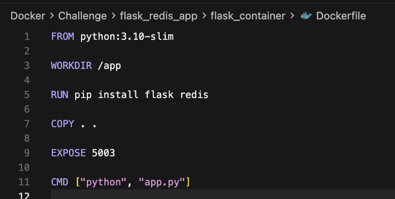

The Flask Dockerfile:
- python:3.10 slim as the base image, 
- sets /app as the working directory inside the container
- runs the command to install flask and redis Python client
- copies the Flask application files from flask_container into /app directory inside the container
- documents the port used by used Flask application with EXPOSE
- Starts the Flask application by running python app.py

## Redis Dockerfile section

The `redis_container` folder contains the Dockerfile used to build the Redis image for this app.

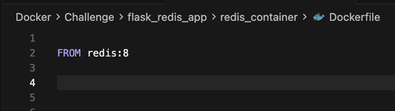

- This uses the official`redis:8` image from Docker Hub as the base image.
- The official image already contains everything required to start a Redis server, no additional configuration is required.

## Docker Compose section
I created a `docker-compose.yaml` file in the root directory. It defines the two services that make up the app.

- web - the Flask application
- redis - the Redis server

Each service points to the folder containing the Dockerfile that should be used to build it.

Docker compose is a tool used to define and run multiple containers together as part of the same application. 

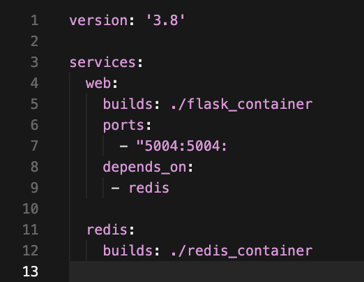

The `docker-compose.yml` file defines the services.

I used 
`docker-compose up -d` 

to create and start the Flask and Redis services. Docker Compose also creates a network for the application, placing the containers on the same network, allowing the Flask container to communicate with the Redis container using its service name, such as `redis`.

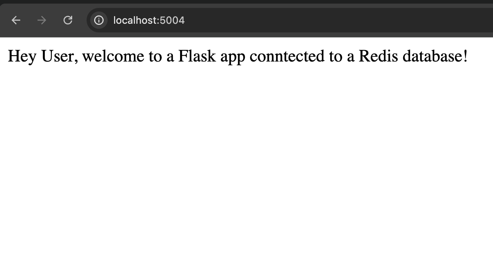

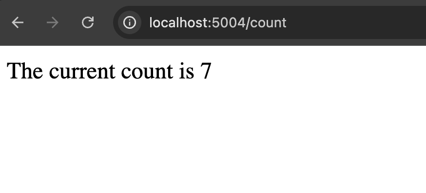

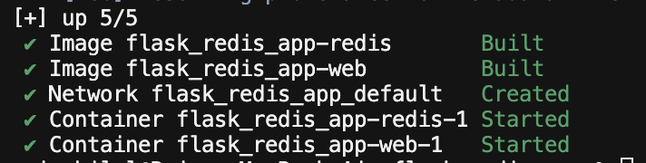

## Bonus Challenge

- Persistent Storage for Redis: Configure Redis to use a volume to persist its data.
- Environment Variables: Modify the Flask application to read Redis connection details from environment variables and update the docker-compose.yml accordingly.
- Scaling the Application: Scale the Flask service to run multiple instances and load balance between them using Docker Compose.

## Using Docker Volume to Persist Data

Containers are designed to be replaceable. If important data only exists inside a container, that data can be lost when the container is removed.

To keep the Redis data separate from the Redis container, I created a named Docker volume called shared-data.

A Docker volume is storage managed by Docker that exists separately from the container. This means I can remove or recreate the Redis container without automatically removing the data stored in the volume.

At the bottom of the `docker-compose.yml` file I created the named Docker Volume:

`volumes:
  shared-data: {}
`

Docker, create and manage a named volume called shared-data.

The official Redis image uses /data inside the container for its saved data, so I mounted the shared-data volume at:

`/data`

inside the Redis container.

The Compose configuration follows the pattern:

`VOLUME_NAME: CONTAINER_PATH`

This means take the Docker volume called `shared-data` and make its contents available at `/data` inside the Redis container.

I did the same with the Flask service

`
web:
  volumes:
    - shared-data:/app/data
`

Take the same shared-data volume and attach it to the Flask container, placint it inside /app/data. 

Docker manages the actual location of a named volume. I do not need to create the volume directory manually or put intitial data inside the Compose file.

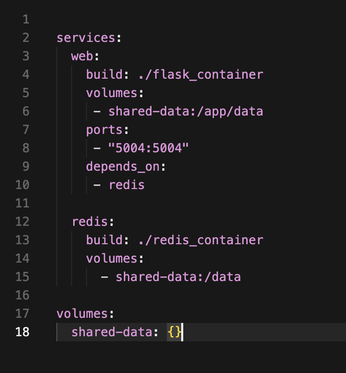

Then I ran:

`docker-compose down`

to remove the existing containers before recreating them with the updated volume configuration.
A normal `docker compose down` does NOT remove named volumes; `docker compose down -v` would remove them.

I then inspected the Redis container to confirm that the volume had been mounted at /data

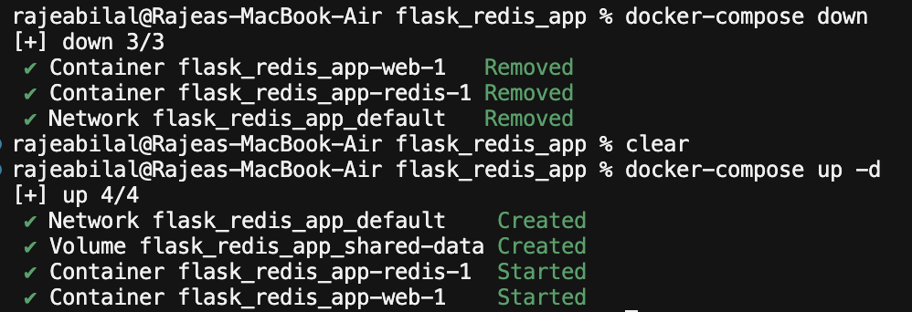

`docker inspect flask_redis_app-web-1`

Checked the Flask app to see if volume has been mounted correctly.

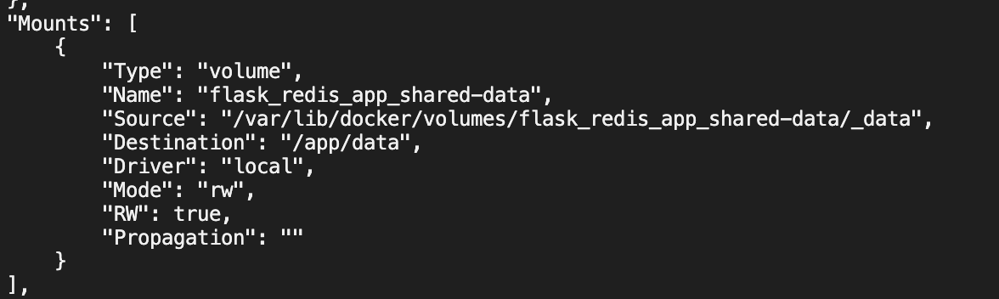

It confirms volume is attached and mounted at the specified path inside the container. 

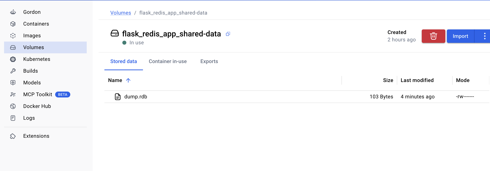

## Environment Variables

In real world environment, its advisable not to hard coded configuration values such as hostnames and port numbers directly into the application. 

Using environment variables to configure apps, adds flexbility, allowing you to easily change configurations without modifying code. 

I changed `app.py` to read the Redis host and port from environment variables instead. 

I then defined those environment variables in `docker-compose.yml`

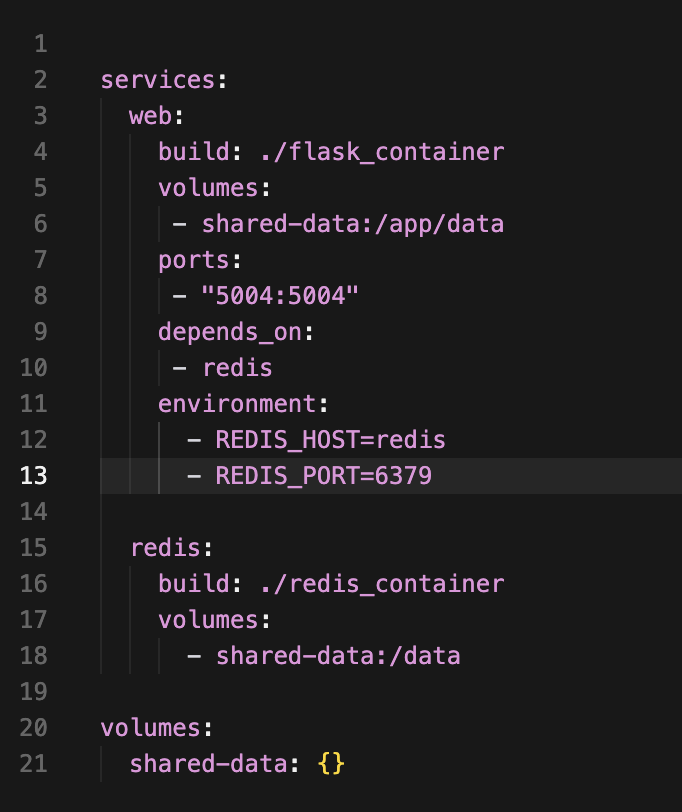

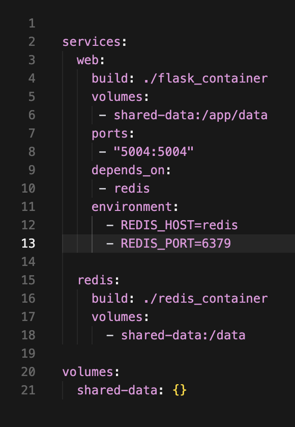

## Scaling services based on traffic

We can expose our Mac app to the Flask app by mapping the ports like

`
ports:
 - "5004:5004"
`

This works because we're mapping 1 port to 1 container. But what if we want to scale our application to multiple containers, how could we map one port to 4 or 5 Flask containers. 

To visualise this problem (and scale the app), I created multiple instances of the Flask app:

`docker-compose up --scale web=3`

This tells Docker Compose to run three containers for the web service (Flask application)

Now we have 3 Flask containers running

- Flask container 1
- Flask container 2
- Flask container 3

All three of them are trying to claim the same port on my Mac - localhost:5004

Only one container can bind to a particular host port at a time. 

This is where NGINX comes in.

NGINX becomes the one container the browser communicates with.

So instead of exposing every Flask container to my mac, I exposed NGINX. 

I placed NGINX infront of the Flask app, so now every time a request comes from the browser, it first goes to NGINX, NGINX then routes the request to the Flask service.

                       Browser 
                          |

                        NGINX Container

   /                      |                  \
Flask Container 1   Flask Container 2     Flask Container 3

NGINX is called a reverse proxy because a reverse proxy sits in front of my application and forwards incoming requests to it.

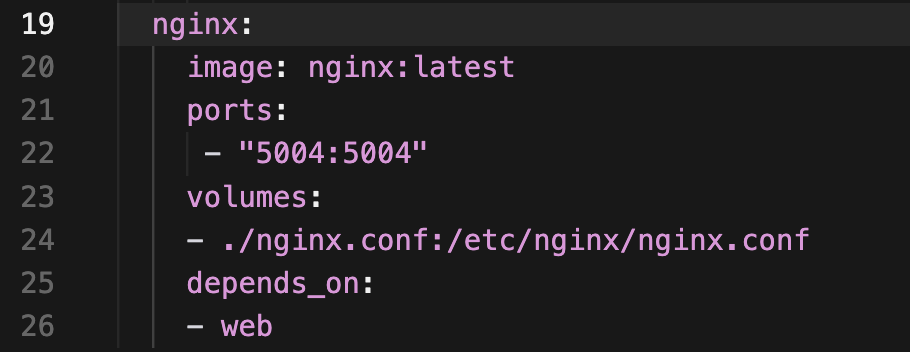

- Use the official NGINX image 
- Request arriving at port 5004 on my machine (Mac) should be sent to port 5004 inside the NGINX container

`
nginx:
  ports:
    - "5004:5004"
`

Take requests arriving on port 5004 of my Mac and send them to port 5004 inside the NGINX container. 

The we do the following in the `docker-compose.yml` file

`
expose:
  - "5004"
`

This means that NGINX will forward the requests to the web service (Flask app) running on port 5004 inside the Docker container.

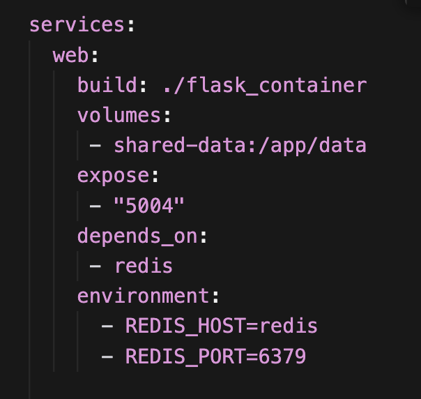

Even though all have them are port 5004, they are different because they are in different network environments.

This diagram can help explain the difference.

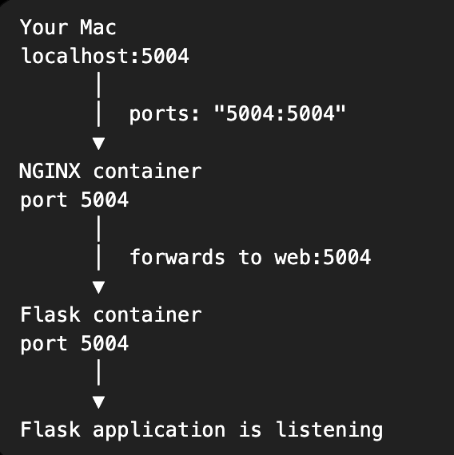

### NGINX.conf file

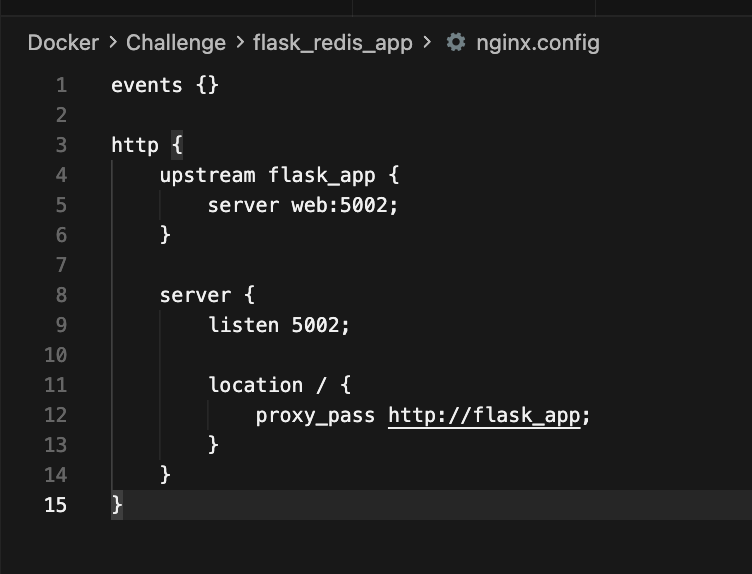

This file does 3 things:

1. Define where Flask app is
2. Tells NGINX where to listen to
3. Tell NGINX to forward requests to Flask

### Where Flask app is

`
upstream flask_app {
    server web:5004;
}
`

Create a destination called flask_app.  
The destination is the Docker Compose service called web, listening to requests on port 5004.
My Flask app is at web:5004. I'm going to refer to it as flask_app

### Tell NGINX where to listen to

`
server {
    listen 5004;
}
`

This server {} is talking about NGINX itself, it means
NGINX should listen for requests on port 5004.

### Tell NGINX where to send the request

Inside that NGINX server block, you have

`
location / {
    proxy_pass http://flask_app;
}
`

When a request comes in for `/` or `/count` or another path, forward them to flask_app
Since we specified flask_app as `web:5004`, the requests are just being forwarded to `web:5004`

`http {}` Instructions for web requests

The host, NGINX container and Flask container can all use the port number 5004 because these ports exist in different network locations. 

Port 5004 on my Mac is not the same port as 5004 inside the NGINX container, 
and NGINX's port 5004 is not the same port as 5004 inside the Flask container. 

NGINX and Flask are connected through the same Docker Compose network.

## Ports vs Expose

`ports` publishes a container port to the host machine

`ports:
    - "5004:5004"
`
means traffic arriving at port 5004 on my machine is forwarded to port 5004 inside the container.

`expose` does not publish the port to the host machine. It describes a port that the service uses internally

Containers on the same Docker Compose network can communicate with each other using their service names and internal ports.

  
`volumes:
    - ./nginx.conf:/etc/nginx/nginx.conf
`

I'm instructing Docker Compose to take my nginx.conf file from my project and make it available inside the NGINX conatiner at /etc/nginx/nginx.conf 

`  
nginx:
    image: nginx:latest
    ports:
        - "5002:5002"
    volumes:
        - ./nginx.conf:/etc/nginx/nginx.conf
    depends_on:
        - web
`

Take my local nginx.conf file and place it where Nginx expects its config files inside the container (bind mount - youre mounting a file from your machine into the container)

## Additional Features

To better demonstrate scaling and load balancing, I used Python's `socket` module to retrieve and display the hostname of the Flask container handling each request.

When NGINX forwards a request to one of the replicated Flask containers, the page shows which container handled it. I also store a separate request count for each Flask container in Redis and update the count whenever the container handles a request.

This makes the load balancing visible, allowing me to see requests being distributed between the different Flask containers

## Styling

As someone with a strong interest in product design and visual aesthetics, once I had built out the functionality, I wanted to improve the interface. 

I moved the page markup file into `templates` folder and organised the static assets separately. The CSS is stored under statis/css. I wanted the visual style to reflect the technical and slightly retro character of the project, so I chose the `Pixelta` typeface. Keeping templates, styles and fonts organised according to their purpose also helped me understand Flask's project structure and kept the codebase easier to navigate and maintain. 

## Problems I ran into

### I mixed up Redis Cloud with a locally running Redis server

I initially used the host, port, username and password shown on the Redis Cloud dashboard. But my actual goal was 

Flask container ----> local Redis container.

So I had to backtrack and understand that for a local Redis server, Flask just needs to connect to a `redis` host on `port=6379`. The `redis` hostname came from the Docker Compose service name. 

## Confusion between host and depends_on in the YAML file

I realised that `host=redis` tells Flask where Redis is

depends_on:
    - redis

Tells Docker Compose which service should be started before the web service.

They both referenced `redis` but do different jobs. 

## Redis connection variable had the wrong scope

One of the issues I faced was a scope problem. 

I had placed the connection to the Redis server inside the `welcome()` that runs when a request hits the root route (/). The problem was when I tried to access Redis in the `display_count()` to display visit count to the user, it was out of scope. 

I fixed this by keeping the Redis connection outside the route functions so either function can access Redis through the `r` variable.

## Redis valudes need converting before doing arithmetic

Another problem was Redis returns a string instead of a number so when I tried to increment the result from Redis, it gave an error. I had to first convert the result from Redis into an integer and then increase it. 

