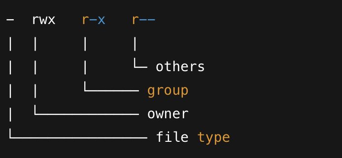
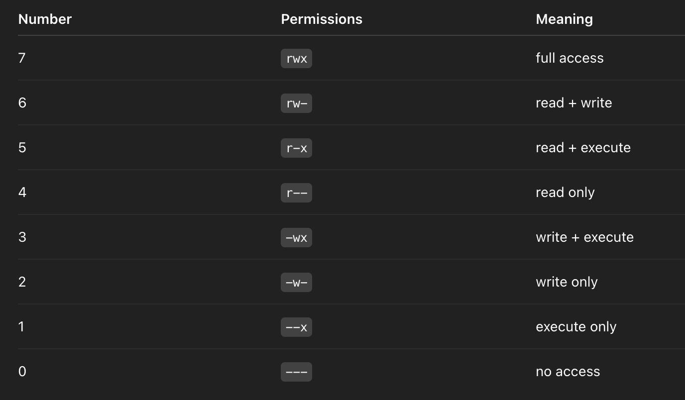

# Linux Notes

Linux protects files and folders by answering 3 questions.
1. Who owns this?
2. Who else is allowed?
3. What are they allowed to do

## Who
Every file and folder has 
- Owner -> usually the user who created it
- Group -> a group of users
- Others -> everyone else on the system

## Permissions
Each of those three (Owner, group, others) get permissions:
- r - read file contents - list files
- w - edit file  - create/delete files
- x - execute file - enter/access directory
 
## How do we see permissions

Run:
```bashls -l
```

Output:
```bash-rwxr-xr--
```



## File Type
- regular file
d - directory
l - symlink

## Changing Permissions (chmod)

```bashchmod = change mode
```
- ch -> change
- mod -> mode

Change the permission mode of a file or directory. <br>
*chmod changes permissions, not ownership*
 
It cannot change who owns the file, or change the contents.

### There are three numbers
```bashchmod XYZ file
```
### Each number controls one group

- X - Owner
- Y - Group
- Z - Others

### Each number has a fixed value

Permissions
- read (r) -------- 4
- write (w) -------- 2
- execute (x) -------1

We add them up.

### Common combinations




### Example command
```bashchmod 644 notes.txt
```


- Owners can read + write
- Groups can read
- Others can read 