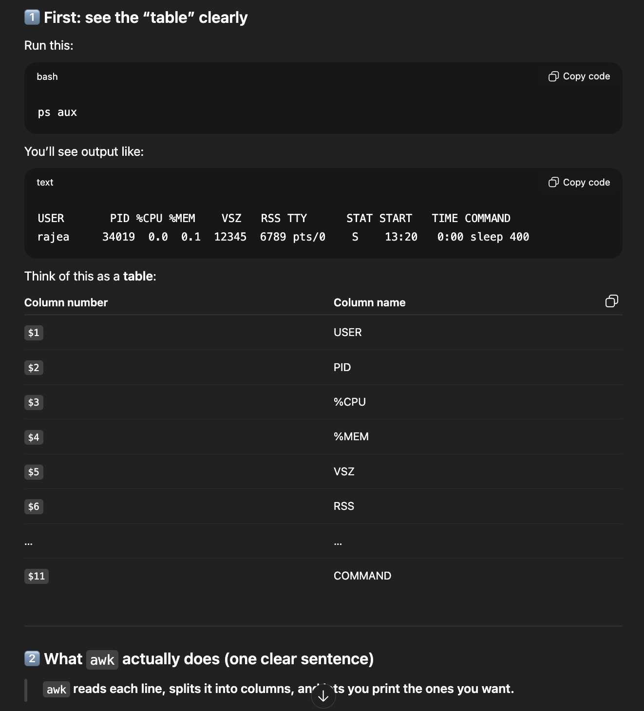
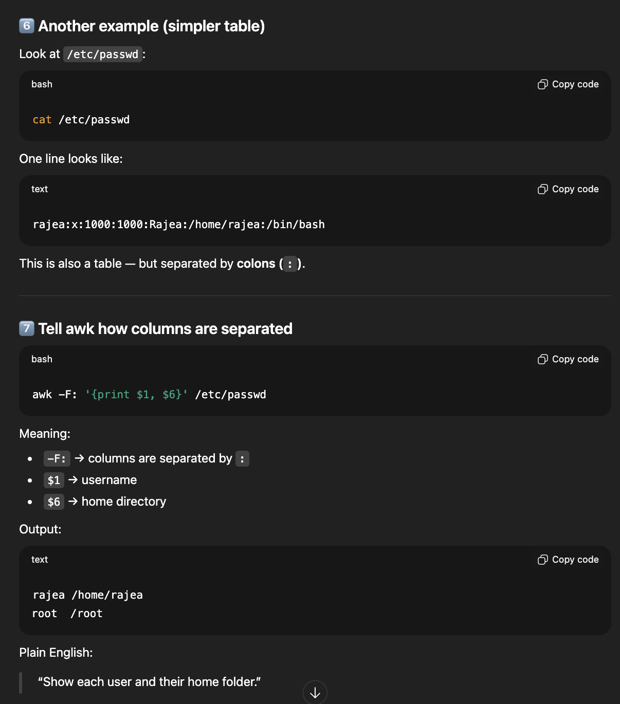

# Linux Text processing

Linux text processing is about taking text, filtering it and reshaping it


## grep

Searches for lines that contain the specific word or pattern

```bashgrep "error" /var/log/syslog
```

**Meaning:**

-Look inside /var/log/syslog
- Show me only lines that contain the word error
- If a line doesn’t have error → it is ignored.

## grep recursive search

```bashgrep -r "TODO" ~/projects/
```
**Meaning:**
- -r = recursive (search inside all folders)
- Look through all files in ~/projects
- Show lines that contain TODO

### Advanced grep

**Case-insensitive search + counting**

```bashgrep -i "failed" /var/log/auth.log | wc -l
```
Break it down:

- grep -i "failed" → find lines with failed (ignore case)
- | → send result to next command
- wc -l → count number of lines


“Count how many times ‘failed’ appears in the auth log.”
This is often used to count login failures.

## awk - extract columns from text

awk is used to pick out specific columns from each line.



```bashps aux | awk '{print $1}'
```
**Meaning:**

- Take each line
- Print only column 1 (USER)

```bashUSER
rajea
root
root
...
```
## Another example, awk




