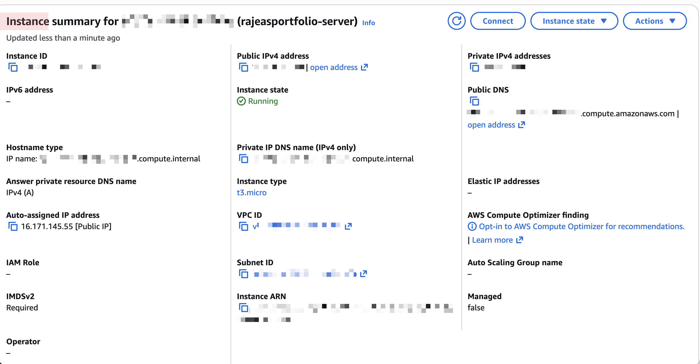
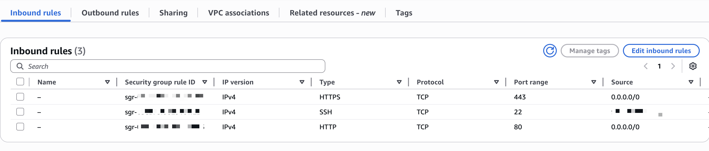
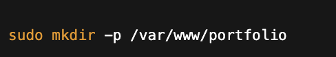
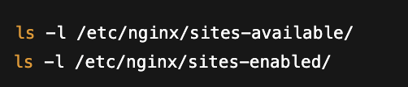
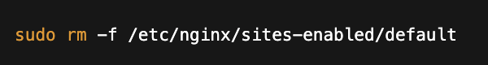
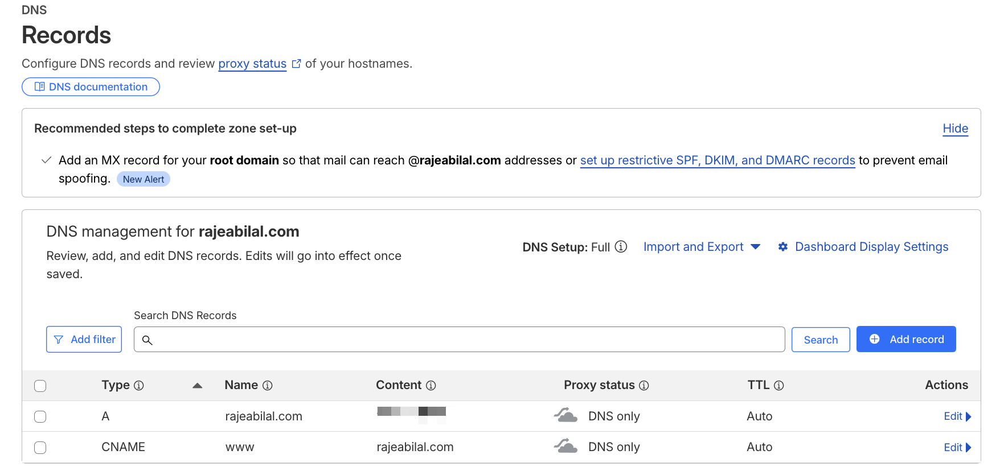
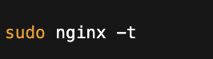
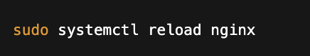

# Portfolio Deployment (AWS EC2 + NGINX + Cloudflare DNS + HTTPS)

This project documents how I deployed my Next.js portfolio to a Linux server I configured myself, using AWS EC2, NGINX, a custom domain (Cloudflare DNS), and HTTPS (Certbot + Let’s Encrypt).

> **Status:** this was a learning exercise and the site has since moved back to Vercel. The reason why is the most useful part — see [What happened next](#what-happened-next--and-why-i-moved-back-to-vercel) at the end.

## What I learned

- How DNS resolution works (domain → IP)

- What an EC2 instance is and how Security Groups control inbound traffic

- How NGINX serves static sites and how sites-available / sites-enabled work

- How HTTPS works at a high level and what a TLS/SSL certificate does

- How Certbot configures NGINX to serve traffic securely on port 443

## Architecture overview

- Domain: managed in Cloudflare

- Server: AWS EC2 (Ubuntu)

- Web server: NGINX

- HTTPS: Certbot + Let's Encrypt

- App: Next.js static export (served as static files)

## Step 1 — Create an EC2 instance (cloud server)

I created an EC2 instance (Ubuntu). EC2 is a virtual machine in AWS that stays online while it's running.

### Security Groups (firewall rules)

I configured the Security Group inbound rules to allow:

- HTTP on port 80

- HTTPS on port 443

- (Optional) SSH on port 22 (restricted to my IP for safer access)

## Step 2 — Install NGINX (turn the server into a web server)

NGINX is the software that receives web requests and returns website files back to the browser.

## Step 3 — Build the Next.js site as static files

My portfolio was built with Next.js, so I generated a static output folder and copied it to the EC2 server.

- Build/export output: `out/`

- Created a web root folder

- Set permissions on the folder

- Copied to a folder like: `/var/www/portfolio`

## Step 4 — Configure NGINX for the site

NGINX on Ubuntu typically uses two folders:

- `sites-available/` = saved configs (not active yet)

- `sites-enabled/` = active configs NGINX actually uses (symlinks)

### What I did

- Check existing configs

- Removed the default site config (so it stops serving the default page)

- Created a new config file for my domain inside sites-available

- Linked it into sites-enabled so NGINX loads it

## Step 5 — Set up HTTPS (TLS/SSL certificate)

By default, the server will serve traffic over HTTP (port 80).

To support HTTPS (port 443), I used:

- Certbot to request a certificate from Let's Encrypt

- Certbot updated the NGINX config to handle secure requests on 443

This allows browsers to connect securely (encrypted traffic).

## Step 6 — Configure DNS in Cloudflare

Finally, I updated Cloudflare DNS so my domain points to my EC2 server.

### What changed

- Replaced the old hosting target (Vercel) with my EC2 public IP

- Added/updated records (typically A records) so:
  - `rajeabilal.com` → EC2 public IP
  - `www.rajeabilal.com` → EC2 public IP (or CNAME to root)

This ensures: when users type the domain, DNS returns the EC2 IP and the browser can connect to the server.

## Result

✅ Site served on a custom domain

✅ NGINX serving the static build

✅ HTTPS enabled with Let's Encrypt

✅ DNS pointing to EC2

---

## What happened next — and why I moved back to Vercel

This deployment worked, but I want to be straightforward about where it ended up: **rajeabilal.com is hosted on Vercel again today.** This was a learning exercise, and it taught me more by ending than it would have by staying up.

The problem was updating it. My portfolio needed new projects added, and with this setup every single content change meant:

1. rebuild the static export locally
2. copy the new `out/` folder up to the server
3. reload NGINX

There was no route from "I made a commit" to "the change is live" that didn't involve me SSH-ing into a box and moving files by hand. For a site I was actively adding to, that was slower than the thing I'd replaced.

That gap has a name, and it's the reason CI/CD pipelines exist. What Vercel had been quietly doing — watching the repository, running the build on a push, and publishing the output — is a pipeline I hadn't yet learned to build myself.

So the honest summary: I can now configure a Linux web server, issue certificates, and point DNS at it. What I couldn't yet do was automate the deploy, which is exactly what I'm learning next.

**Coming back to this:** once I've worked through Docker and CI/CD, I want to redeploy this to the same EC2 instance — containerised, with a pipeline that builds and ships on every push to `main`. That's the version worth keeping online.

## Repeated Commands

Test NGINX Config

Reload NGINX Config without killing connections

Restart NGINX 

