# Portfolio Deployment (AWS EC2 + NGINX + Cloudflare DNS + HTTPS)

This repo documents how I deployed my Next.js portfolio to a live Linux server using AWS EC2, NGINX, a custom domain (Cloudflare DNS), and HTTPS (Certbot + Let’s Encrypt).

## What I learned

- How DNS resolution works (domain → IP)

- What an EC2 instance is and how Security Groups control inbound traffic

- How NGINX serves static sites and how sites-available / sites-enabled work

- How HTTPS works at a high level and what a TLS/SSL certificate does

- How Certbot configures NGINX to serve traffic securely on port 443

## Architecture overview

- Domain: managed in Cloudflare

- Server: AWS EC2 (Ubuntu)

- Web server: NGINX

- HTTPS: Certbot + Let's Encrypt

- App: Next.js static export (served as static files)

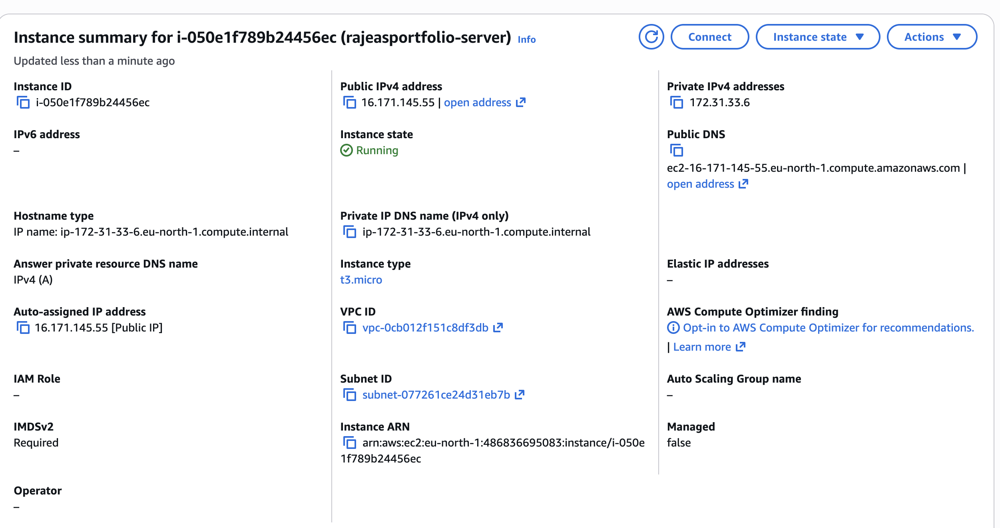

## Step 1 — Create an EC2 instance (cloud server)

I created an EC2 instance (Ubuntu). EC2 is a virtual machine in AWS that stays online while it's running.

### Security Groups (firewall rules)

I configured the Security Group inbound rules to allow:

- HTTP on port 80

- HTTPS on port 443

- (Optional) SSH on port 22 (restricted to my IP for safer access)

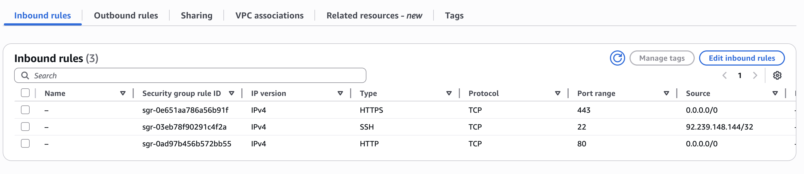

## Step 2 — Install NGINX (turn the server into a web server)

NGINX is the software that receives web requests and returns website files back to the browser.

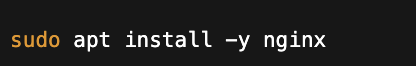
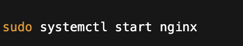

## Step 3 — Build the Next.js site as static files

My portfolio was built with Next.js, so I generated a static output folder and copied it to the EC2 server.

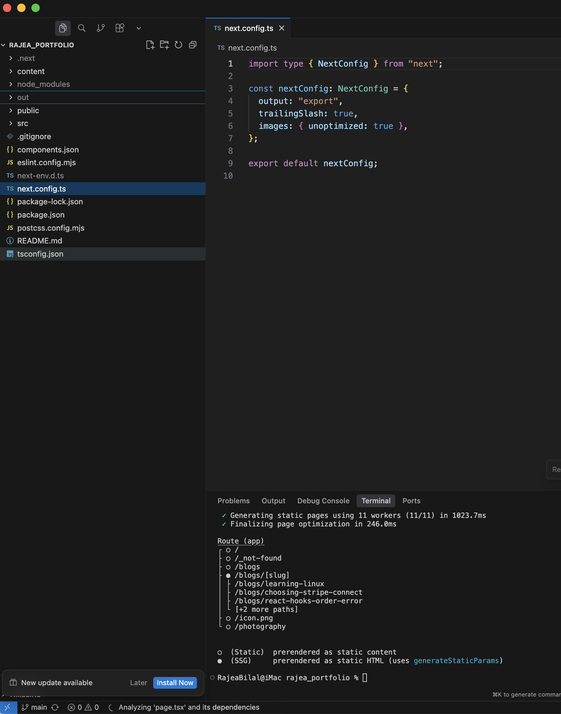

- Build/export output: `out/`

- Created a web root folder

- Set permissions on the folder

- Copied to a folder like: `/var/www/portfolio`

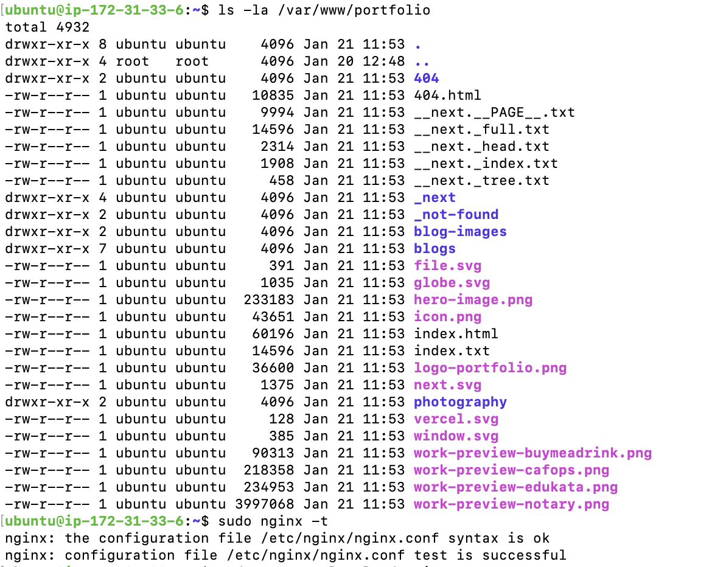

## Step 4 — Configure NGINX for the site

NGINX on Ubuntu typically uses two folders:

- `sites-available/` = saved configs (not active yet)

- `sites-enabled/` = active configs NGINX actually uses (symlinks)

### What I did

- Check existing configs

- Removed the default site config (so it stops serving the default page)

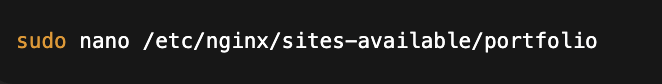

- Created a new config file for my domain inside sites-available

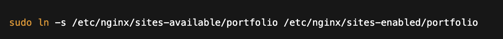

- Linked it into sites-enabled so NGINX loads it

## Step 5 — Set up HTTPS (TLS/SSL certificate)

By default, the server will serve traffic over HTTP (port 80).

To support HTTPS (port 443), I used:

- Certbot to request a certificate from Let's Encrypt

- Certbot updated the NGINX config to handle secure requests on 443

This allows browsers to connect securely (encrypted traffic).

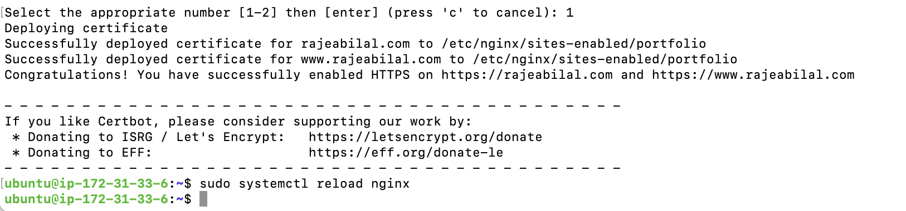

## Step 6 — Configure DNS in Cloudflare

Finally, I updated Cloudflare DNS so my domain points to my EC2 server.

### What changed

- Replaced the old hosting target (Vercel) with my EC2 public IP

- Added/updated records (typically A records) so:
  - `rajeabilal.com` → EC2 public IP
  - `www.rajeabilal.com` → EC2 public IP (or CNAME to root)

This ensures: when users type the domain, DNS returns the EC2 IP and the browser can connect to the server.

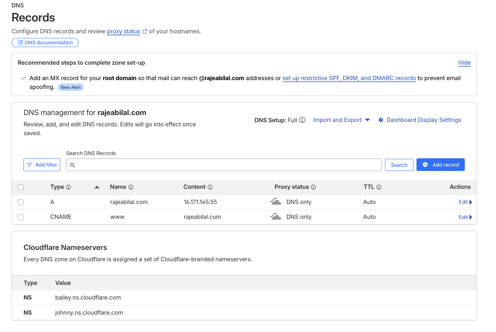

## Result

✅ Site is live on a custom domain

✅ NGINX serves the static build

✅ HTTPS enabled with Let's Encrypt

✅ DNS correctly points to EC2

**Live:** https://rajeabilal.com

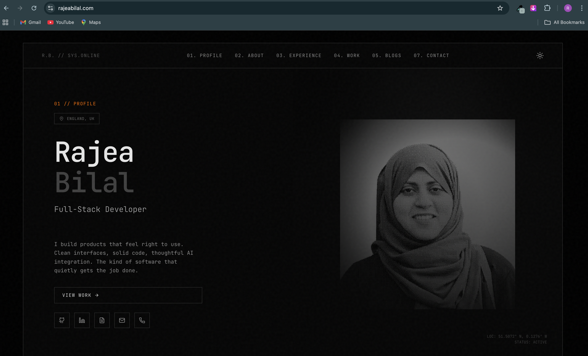

## Repeated Commands

Test NGINX Config

Reload NGINX Config without killing connections

Restart NGINX 

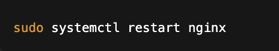