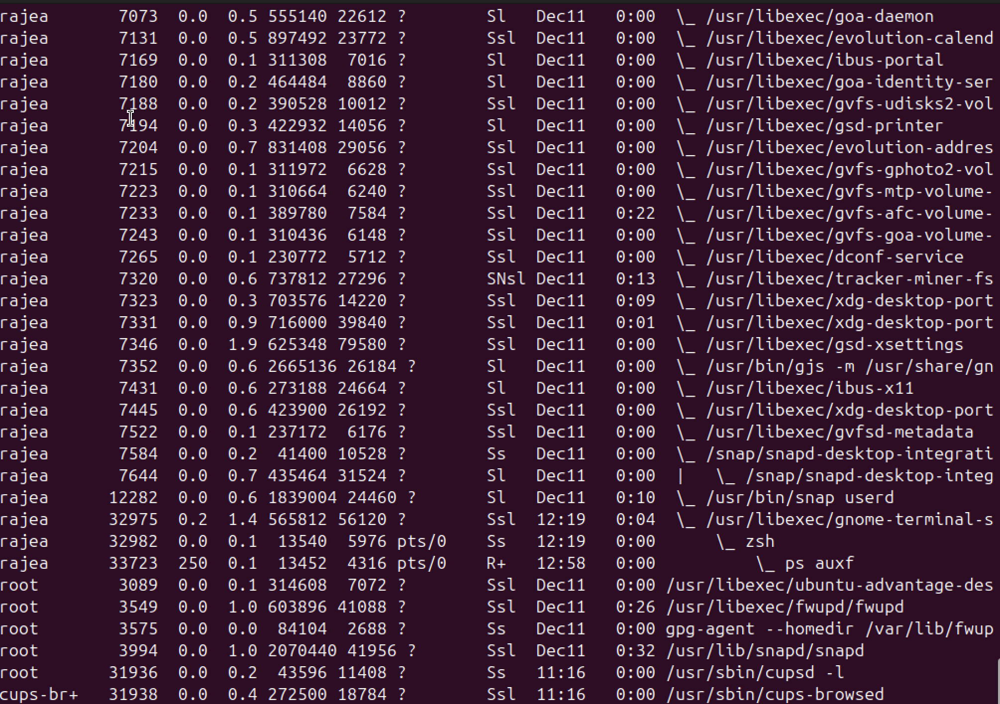
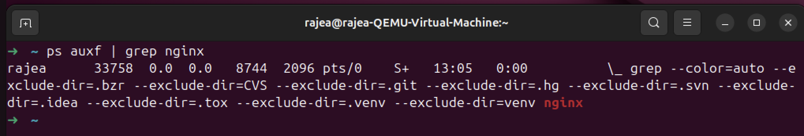
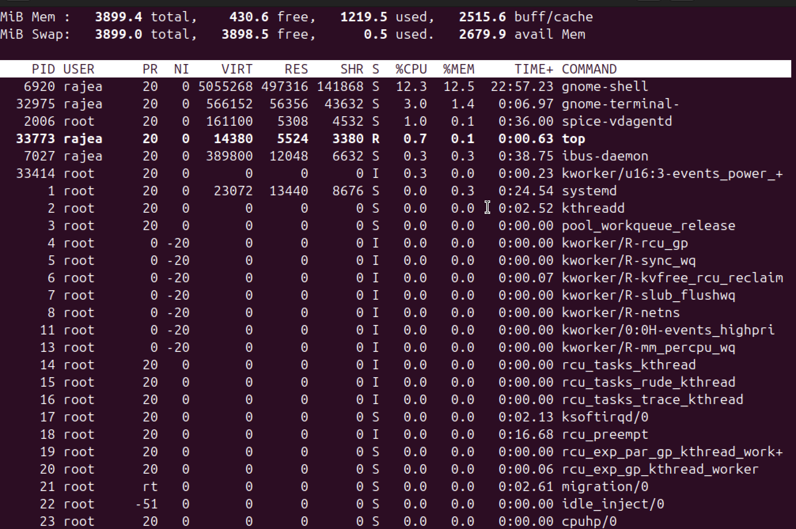
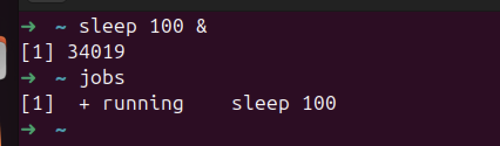
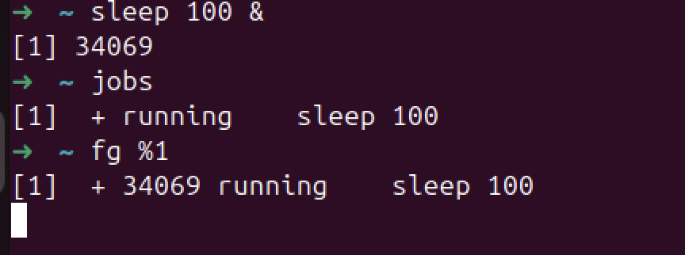

## Root

### Root is 
- not a human, 
- not someone else on the computer

Its a system account created when Linux is installed. 
Instead of letting everyone do dangerous things, normal users are restricted, only *root* can change the system.

### Root has 
- Unlimited permissions
- Can change ownership
- Can edit 
- Doesnt need sudo

### On Ubuntu
- root login is disabled by default
- we use sudo instead

### What is sudo
It means "Run this one command as root"

## Ownership vs Permission
If we change ownership to root:root, the permissions stay the same but the ownership changes. What that means is is that me (user:rajea) will become *Others* now and have the same permissions as *Others* and unless we use *sudo*, I cant change the permissions either . 


## Process Management

```23:23:linux-notes.md
ps aux
```
- p - processes
- a - from all the users
- u - in a user-centric format
- x - include processes not attached to the terminal


Show me all the running processes on this machine


```23:23:linux-notes.md
ps aux | grep nginx
```

Show a list of all the processes running, take the output and pass it as an input to the second command (grep nginx), filter out only the ones related to nginx



## top



Shows a live, constantly updating list of running processes and how much CPU and memory they’re using.

Its like a task manager but in terminal.

Press q to exit.

We use top when:
- system feels slow
- fan is spinning loudly
- something is using to much CPU
- need to find a runaway process
- want a PID to kill

ps aux VS top

- pus aux --> snapshot
- top ---> live video feed

## htop
Same idea as top, but easier to read 
More friendly interface

## sleep

```23:23:linux-notes.md
sleep 100 &
```


Do nothing for 100 seconds, run this command in the background and then exit.
& - in the background 

## job
When you run something in the background from your terminal, Linux calls it a job. 

```23:23:linux-notes.md
jobs
```

What background jobs are running from this terminal?

```23:23:linux-notes.md
fg %1
```

Bring job number 1 back to the terminal



- the terminal becomes blocked
- the command is running infront of you 

- **sleep** is a safe command that runs for a set time and is used to practice process management.
- **&** runs a command in the background.
- **jobs** shows background jobs started from the current terminal.
- **fg** brings a background job to the foreground.
- **bg** sends it back to the background.
- **kill** stops a process using its PID.
- **killall** stops all processes with a given name.

## Q&A on Program processing 

## Flashcard 1

Front:
What does the kill command do?

Back:
kill sends a signal to a process, usually asking it to stop running.

## Flashcard 2

Front:
What information do you need to use kill?

Back:
You need the process ID (PID) of the running process.

## Flashcard 3

Front:
What does kill <PID> mean?

Back:
It sends a termination signal to the process with that specific PID.

## Flashcard 4

Front:
How do you usually find a PID before using kill?

Back:
By using commands like ps aux, top, htop, or jobs -l.

## Flashcard 5

Front:
What happens when you run kill 12345?

Back:
Linux asks process 12345 to stop gracefully.

## Flashcard 6

Front:
Does kill always immediately stop a process?

Back:
No. It politely asks the process to stop; the process may ignore it.

## Flashcard 7

Front:
What does kill -9 <PID> do?

Back:
It forcefully stops the process immediately using the SIGKILL signal.

## Flashcard 8

Front:
When should kill -9 be used?

Back:
Only when a process refuses to stop normally, because it cannot clean up safely.

## Flashcard 9

Front:
What does the killall command do?

Back:
killall stops all running processes with a given name.

## Flashcard 10

Front:
What does killall sleep do?

Back:
Stops every running process named sleep.

## Flashcard 11

Front:
What is the main difference between kill and killall?

Back:
kill targets one process by PID, while killall targets all processes by name.

## Flashcard 12

Front:
Why should killall be used carefully?

Back:
Because it can stop multiple processes at once, including important system programs.

## Flashcard 13

Front:
Why is sleep safe to practice with kill and killall?

Back:
Because it is harmless, does nothing, and stopping it has no side effects.

## Flashcard 14

Front:
What is the relationship between Ctrl+C and kill?

Back:
Ctrl+C sends a termination signal to the foreground process, similar to kill.

## Flashcard 15

Front:
Why do DevOps engineers need to understand kill and killall?

Back:
To stop misbehaving, stuck, or resource-heavy processes safely on servers.